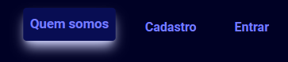
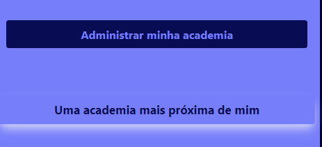
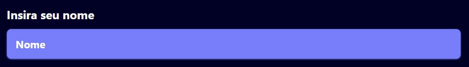

# GymGo

## Projeto voltado para check-in de alunos para diferentes academias, administração de entrada e saídas de cliente para cada plano, administração de alunos para academia.

<aside>
💡 Dashboard de demandas → [https://trello.com/b/YVRGkB90/kanban-quadro-modelo](https://trello.com/b/YVRGkB90/kanban-quadro-modelo)
Fluxo do usuário → [https://miro.com/app/board/uXjVMHku6ek=/](https://miro.com/app/board/uXjVMHku6ek=/)
Figma → https://www.figma.com/file/juBBfyyQHqJj2T25RnSG0z/GymGo?type=design&node-id=0-1&mode=design&t=LmN6cf1KzlXPNARG-0

</aside>

## Criação de projeto

Create project using npm with exempla cypress setings.

```jsx
npx create-next-app@latest -e with-cypress --use-npm gym-go

What is your project named? gym-go
Would you like to use TypeScript? Yes
Would you like to use ESLint? Yes
Would you like to use Tailwind CSS? Yes
Would you like to use `src/` directory? Yes
Would you like to use App Router? (recommended) Yes
Would you like to customize the default import alias? Yes
What import alias would you like configured? @/*
```

<aside>
💡 Options settings create project.

</aside>

## Layouts

### LADING PAGE

## Components

### Primary button

Para o primeiro botão do sistema, o botão primario será um botão padrão que consiste em ações quais do usuário. Já foi implementado funcionalidades de hover e focus para acessibilidade.



```
interface PrimaryButtonProps extends ButtonHTMLAttributes<HTMLButtonElement> {
  children: ReactNode
}

export function PrimaryButton({ children, ...props }: PrimaryButtonProps) {
  return (
    <button
      {...props}
      type="button"
      className="p-2 rounded ease-in duration-300 hover:bg-secondary-blue hover:shadow-lg hover:shadow-tertiary-purple hover:-translate-y-1 hover:scale-105 animate-visible focus:outline-none border-none focus:-translate-y-1 focus:scale-105 focus:shadow-lg focus:shadow-tertiary-purple focus:bg-secondary-blue"
    >
      <span className="text-primary-purple font-bold text-base">
        {children}
      </span>
    </button>
  )
}
```

### Secondary button

Segundo component do sistema, o botão secondário será um botão padrão que consiste em ações quais do usuário. Já foi implementado funcionalidades de hover e focus para acessibilidade.



```
import { ButtonHTMLAttributes, ReactNode } from 'react'

interface SecondaryButtonProps extends ButtonHTMLAttributes<HTMLButtonElement> {
  children: ReactNode
}

export function SecondaryButton({ children, ...props }: SecondaryButtonProps) {
  return (
    <button
      {...props}
      type="button"
      className="p-2 rounded ease-in duration-300 hover:bg-transparent hover:shadow-lg hover:shadow-tertiary-purple hover:-translate-y-1 hover:scale-105 animate-visible focus:outline-none border-none focus:-translate-y-1 focus:scale-105 focus:shadow-lg focus:shadow-tertiary-purple focus:text-primary-purple focus:bg-secondary-blue text-primary-purple hover:text-secondary-blue font-bold text-lg bg-secondary-blue w-full"
    >
      {children}
    </button>
  )
}
```

### Input Form

Componente de input para formulário, com propriedade label, em breve será modificado para adição de erro.



```
import * as React from 'react'

import { cn } from '@/lib/utils'

export interface InputProps
  extends React.InputHTMLAttributes<HTMLInputElement> {
  label: string
}

const Input = React.forwardRef<HTMLInputElement, InputProps>(
  ({ className, type, label, ...props }, ref) => {
    return (
      <>
        <label htmlFor={props.id} className="text-base text-white font-bold">
          {label}
        </label>
        <input
          type={type}
          id={props.id}
          className={cn(
            'flex h-10 w-full rounded-md border-input bg-background px-3 py-3 text-sm ring-offset-background file:border-0 file:bg-transparent file:text-sm file:font-medium placeholder:text-muted-foreground focus-visible:outline-none focus-visible:ring-2 focus-visible:ring-ring focus-visible:ring-offset-2 disabled:cursor-not-allowed disabled:opacity-50 bg-primary-purple text-white font-bold placeholder:text-white shadow-sm shadow-primary-purple',
            className,
          )}
          ref={ref}
          {...props}
        />
      </>
    )
  },
)
Input.displayName = 'Input'

export { Input }
```

## Pipeline

```yaml
name: CI

on:
  push:
    branches:
      - develop

jobs:
  CI:
    name: Continuous Integration
    runs-on: ubuntu-latest

    steps:
        - name: Checkout repository
          uses: actions/checkout@v3

        - name: Setup Node
          uses: actions/setup-node@v3
          with:
            node-version: 18.x
      
        - name: Install packages
          run: npm install
      
        - name: Run tests
          run: npm run test
```

## Package ESlint

<aside>
💡 npm instal eslint @eduardo1199/eslint-config -D

</aside>

This is a package is my eslint config → ****[@eduardo1199/eslint-config](https://www.npmjs.com/package/@eduardo1199/eslint-config)****

## Packages

```json
{
  "private": true,
  "scripts": {
    "dev": "next dev",
    "build": "next build",
    "start": "next start",
    "e2e": "start-server-and-test dev http://localhost:3000 \"cypress open --e2e\"",
    "e2e:headless": "start-server-and-test dev http://localhost:3000 \"cypress run --e2e\"",
    "component": "cypress open --component",
    "component:headless": "cypress run --component",
    "lint": "eslint src --ext ts,tsx --report-unused-disable-directives --max-warnings 0 --fix",
    "prepare": "husky install"
  },
  "dependencies": {
    "@hookform/resolvers": "^3.2.0",
    "@radix-ui/themes": "^1.0.0",
    "axios": "^1.4.0",
    "next": "latest",
    "next-auth": "^4.23.1",
    "nookies": "^2.5.2",
    "react": "18.2.0",
    "react-dom": "18.2.0",
    "react-hook-form": "^7.45.4",
    "zod": "^3.22.2"
  },
  "devDependencies": {
    "@commitlint/cli": "^17.7.1",
    "@commitlint/config-conventional": "^17.7.0",
    "@eduardo1199/eslint-config": "^1.0.0",
    "@types/node": "18.0.6",
    "@types/react": "18.0.15",
    "@types/react-dom": "18.0.6",
    "autoprefixer": "^10.4.15",
    "cypress": "12.3.0",
    "eslint": "^8.47.0",
    "husky": "^8.0.0",
    "postcss": "^8.4.28",
    "start-server-and-test": "1.15.2",
    "tailwindcss": "^3.3.3",
    "typescript": "4.7.4"
  }
}
```

## Dependências

- NextJS
- Next-Auth
- ReactJS
- RadixUi/themes
- Typescript
- Cypress
- TailwindCSS
- Eslint
- ReactHookForm
- Zod
- Axios
- Nookies
